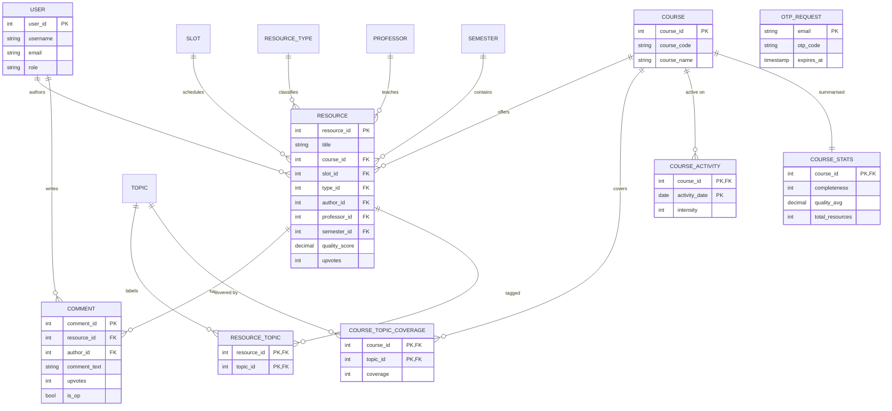

# UniArchive — DBMS Case Study

A database-driven study-resource platform, carried through the full design
lifecycle: requirements → ER/EER → relational model → normalization → DDL →
DML → application → testing → demonstration.

| Stage | Deliverable in this repository |
|-------|--------------------------------|
| 1. Problem identification & requirement analysis | §1 |
| 2. ER / EER diagram | §2 |
| 3. ER → relational model | §3 |
| 4. Normalization (1NF, 2NF, 3NF) | §4 |
| 5. Database design & table creation (DDL) | `db/schema.sql`, §5 |
| 6. Data population (DML) | `db/seed.sql`, §6 |
| 7. Front-end design | `components/`, §7 |
| 8. Business logic implementation | `server/src/controllers/`, §8 |
| 9. Database connectivity | `server/src/config/db.ts`, `server/src/repositories/`, §9 |
| 10. Testing & validation | `server/test/`, §10 |
| 11. Demonstration & documentation | §11 |

---

## 1. Problem Identification & Requirement Analysis

**Problem.** University students accumulate course material — handwritten
notes, question banks, cheatsheets, lab reports, previous-year solutions — but
there is no single place to share and discover it. Material is scattered across
messaging groups and drives, is hard to search, and there is no signal of
quality or completeness.

**Goal.** A searchable archive where students can:

1. browse resources filtered by **course**, **slot** and **resource type**;
2. **search** across titles, courses, professors and topics;
3. **read** a resource inline and **download** it;
4. **upload** new material with metadata (course, slot, type, topics, professor,
   semester);
5. **discuss** resources through comments and **upvote** useful ones;
6. see **analytics** — per-course completeness/quality and topic coverage.

**Functional requirements**

| ID | Requirement |
|----|-------------|
| FR1 | Add a resource with title, course, slot, type, topics, professor, semester, file |
| FR2 | List/filter resources by type, slot, course |
| FR3 | Free-text search across title, course code, professor, topic |
| FR4 | View a resource with its comment thread |
| FR5 | Upvote / download / view counters |
| FR6 | Comment on a resource |
| FR7 | Per-course analytics: completeness, quality average, resource count, topic coverage, activity heatmap |
| FR8 | Email-OTP based sign-in |

**Non-functional requirements**

| ID | Requirement |
|----|-------------|
| NFR1 | Data integrity — no orphan resources, comments or topics (enforced by FKs and CHECKs) |
| NFR2 | No redundancy — normalized to 3NF, so a course code or topic name is stored once |
| NFR3 | Query performance — indexes on every foreign key and on search columns |
| NFR4 | Atomic writes — uploads touching several tables run in one transaction |

---

## 2. ER / EER Diagram

### Entities and attributes

| Entity | Key attributes | Notes |
|--------|----------------|-------|
| **User** | `user_id`, username, email, role, is_verified | authors resources and comments |
| **Course** | `course_id`, course_code, course_name | |
| **Slot** | `slot_id`, slot_code | B1, G2, … |
| **ResourceType** | `type_id`, type_name | Notes / Question Bank / Cheatsheet / Lab Report / Solution |
| **Topic** | `topic_id`, topic_name | atomic tag |
| **Professor** | `professor_id`, professor_name | |
| **Semester** | `semester_id`, semester_name, year | (term, year) pair |
| **Resource** | `resource_id`, title, quality_score, completeness, upvotes, downloads, views, description, pdf_url | the central entity |
| **Comment** | `comment_id`, text, upvotes, is_op | **weak entity** on Resource |
| **OTPRequest** | email, otp_code, expires_at | login tokens |

### Relationships

| Relationship | Cardinality | Meaning |
|--------------|-------------|---------|
| User **posts** Resource | 1 : N | one author, many resources |
| User **writes** Comment | 1 : N | |
| Course **offers** Resource | 1 : N | |
| Slot **schedules** Resource | 1 : N | |
| ResourceType **classifies** Resource | 1 : N | |
| Professor **teaches** Resource | 1 : N (optional) | |
| Semester **contains** Resource | 1 : N (optional) | |
| Resource **tagged with** Topic | **M : N** | resolved by `resource_topics` |
| Resource **has** Comment | 1 : N | existence-dependent → weak entity |
| Course **covers** Topic | **M : N** | with a `coverage` attribute → `course_topic_coverage` |
| Course **has activity on** Date | 1 : N | → `course_activity` |

### ER diagram (Mermaid)



### EER extensions

- **Specialization.** `ResourceType` models a *disjoint* specialization of
  Resource: every resource is exactly one of Notes, Question Bank, Cheatsheet,
  Lab Report or Solution. It is implemented as a lookup table with a CHECK
  constraint rather than separate subtype tables, because the subtypes share all
  attributes (only the label differs).
- **Weak entity.** `Comment` has no independent identity — its identifier is
  only meaningful inside its owning `Resource`. Enforced with
  `ON DELETE CASCADE`.
- **Associative entities with attributes.** `course_topic_coverage` and
  `course_activity` are relationships that carry their own data (`coverage`,
  `intensity`).
- **Multi-valued attributes.** `Resource.topics` and `Course.topicCoverage` are
  resolved into the junction tables above.

---

## 3. ER → Relational Model

Mapping rules applied:

1. **Strong entity → relation.** Each strong entity becomes a table with its key.
2. **Weak entity → relation with owner key.** `Comment` gets an FK to
   `Resource`; deletion of the owner cascades.
3. **1:N relationship → foreign key on the many side.** `resources` carries
   `course_id`, `slot_id`, `type_id`, `author_id`, `professor_id`, `semester_id`.
4. **M:N relationship → new relation.** `resource_topics(resource_id, topic_id)`
   and `course_topic_coverage(course_id, topic_id, coverage)`; the primary key
   is the pair of foreign keys (plus the attribute for the latter).
5. **Multi-valued attribute → new relation.** `topics[]` and `topicCoverage[]`.
6. **Composite attribute → atomic columns.** `Semester` (term, year) and the
   derived `activityGrid` (date, intensity).
7. **Optional relationships → nullable FK.** `professor_id`, `semester_id`.

Result: **14 relations** (13 base tables + 1 view).

---

## 4. Normalization

The original prototype stored everything in MongoDB documents. Those documents
are the *unnormalized* starting point; the relational tables are the normalized
result.

### Unnormalized form (UNF)

```
Resource( id, title, courseCode, slot, type,
          topics{...},                    -- repeating group
          qualityScore, completeness, upvotes, downloads, views,
          author, professor, semester, year, description, pdfUrl,
          comments{ id, author, text, timestamp, upvotes, isOp } )
```

Two repeating groups (`topics`, `comments`) and several non-atomic /
non-deterministic attributes (`author`, `slot`, `courseCode` duplicated
everywhere) are present.

### First Normal Form (1NF) — atomic values, no repeating groups

`topics{}` and `comments{}` are extracted into their own relations:

- `topics(topic_id, topic_name)` + `resource_topics(resource_id, topic_id)`
- `comments(comment_id, resource_id, author_id, comment_text, upvotes, is_op, created_at)`

Now every cell holds exactly one atomic value and every table has a primary key.
`topics` are stored one row per tag, so nothing is comma-separated.

### Second Normal Form (2NF) — no partial dependency on a composite key

Only the associative relations have composite keys, and each is minimal:

| Relation | Key | Non-key attribute | Depends on |
|----------|-----|-------------------|------------|
| `resource_topics` | (resource_id, topic_id) | — | pure junction, nothing to split |
| `course_topic_coverage` | (course_id, topic_id) | `coverage` | the **whole** pair — a topic can be covered to different degrees in different courses |
| `course_activity` | (course_id, activity_date) | `intensity` | the **whole** pair |

Before this step, topic/coverage/activity data lived as arrays *inside* a
single row, so `coverage` was not even a relation. No proper subset of any key
is unique — verified structurally in `server/test/schema.test.ts`
("junction tables carry no partial dependency").

### Third Normal Form (3NF) — no transitive dependency

Every non-key attribute depends directly on the key, and only on the key.
The interesting extractions:

| Was | Problem | Now |
|-----|---------|-----|
| `Resource.courseCode` repeated on every row | transitive: `resource_id → course_code → course_name` | `courses(course_id, course_code, course_name)` + FK |
| `Resource.author` (free text) | no entity, no integrity | `users` + `author_id` FK |
| `Resource.professor` repeated | transitively determined by name | `professors` + FK |
| `Resource.semester`, `Resource.year` | composite, repeated | `semesters(semester_name, year)` + FK |
| `Resource.slot` string | repeated | `slots` + FK |
| `Resource.type` enum | repeated | `resource_types` + FK |
| `CourseStats.topicCoverage[]` | repeating | `course_topic_coverage` |
| `CourseStats.activityGrid[]` | repeating | `course_activity` |

### The one deliberate exception

`resources.upvotes / downloads / views` are **maintained counters**. Technically
they are derivable (from interaction events) and therefore redundant. They are
kept as columns on purpose, because the app reads them on every card render and
recomputing them from an event log each time would be far more expensive. This
is *controlled denormalization for read performance* — a trade-off that must be
stated, not hidden: the columns are constrained non-negative and always updated
through the API, never by hand.

---

## 5. Database Design & Table Creation (DDL)

Full script: **`db/schema.sql`**. It drops/creates the database and all
relations, then one view. Highlights:

```sql
CREATE TABLE `resources` (
    resource_id   INT NOT NULL AUTO_INCREMENT,
    title         VARCHAR(255) NOT NULL,
    course_id     INT NOT NULL,
    slot_id       INT NOT NULL,
    type_id       INT NOT NULL,
    author_id     INT NOT NULL,
    professor_id  INT NULL,
    semester_id   INT NULL,
    quality_score DECIMAL(5,2) NOT NULL DEFAULT 0.00,
    completeness  TINYINT UNSIGNED NOT NULL DEFAULT 50,
    ...
    CONSTRAINT fk_resources_course FOREIGN KEY (course_id) REFERENCES courses(course_id),
    CONSTRAINT chk_resources_completeness CHECK (completeness BETWEEN 0 AND 100),
    ...
);
```

Design decisions:

- **InnoDB** everywhere → real foreign keys and transactions.
- **Surrogate `AUTO_INCREMENT` keys** on entities; meaningful attributes
  (`course_code`, `slot_code`, `topic_name`, `username`) get UNIQUE constraints.
- **Referential actions** — `ON DELETE CASCADE` from `resources` to `comments`,
  `resource_topics`, `course_stats`, `course_topic_coverage`, `course_activity`.
- **CHECK constraints** enforce domains: completeness/quality 0–100, counters
  ≥ 0, activity intensity 0–4, `resource_types.type_name` in the known set,
  OTP codes matching `^[0-9]{6}$`.
- **Indexes** on every foreign key plus `title` for search.
- **View** `v_course_overview` for the analytics dashboard.

---

## 6. Data Population (DML)

Full script: **`db/seed.sql`**. It loads 10 resources, 34 resource-topic links,
3 comments, 13 users, 8 courses and 16 course-topic coverage rows.

The 2 912-row activity series is generated with set-based SQL rather than typed
out:

```sql
INSERT INTO course_activity (course_id, activity_date, intensity)
SELECT c.course_id,
       DATE_SUB(CURDATE(), INTERVAL (363 - n.d) DAY),
       CASE WHEN ((n.d * 7 + c.course_id * 13) % 10) > 6
            THEN ((n.d * 3 + c.course_id * 5) % 4) + 1 ELSE 0 END
  FROM courses c
  CROSS JOIN ( /* derived digit tables producing 0..363 */ ) n
 WHERE n.d < 364;
```

The script ends with a `UNION ALL` row-count report so loading is self-verifying.

### Query catalogue (for the demonstration)

```sql
-- Q1: every resource with its course, slot, type and author (6-way join)
SELECT r.title, c.course_code, s.slot_code, rt.type_name, u.username
  FROM resources r
  JOIN courses c ON c.course_id = r.course_id
  JOIN slots   s ON s.slot_id   = r.slot_id
  JOIN resource_types rt ON rt.type_id = r.type_id
  JOIN users   u ON u.user_id   = r.author_id;

-- Q2: resources and their topics (aggregate)
SELECT r.title, GROUP_CONCAT(t.topic_name ORDER BY t.topic_name SEPARATOR ', ')
  FROM resources r
  JOIN resource_topics rt ON rt.resource_id = r.resource_id
  JOIN topics t ON t.topic_id = rt.topic_id
 GROUP BY r.resource_id;

-- Q3: top 5 slots by resource count with average quality
SELECT s.slot_code, COUNT(*) AS resources, ROUND(AVG(r.quality_score)) AS avg_quality
  FROM resources r JOIN slots s ON s.slot_id = r.slot_id
 GROUP BY s.slot_code ORDER BY resources DESC LIMIT 5;

-- Q4: search across title / course / professor / topic (the API's search)
SELECT DISTINCT r.title
  FROM resources r
  JOIN courses c ON c.course_id = r.course_id
  LEFT JOIN professors p ON p.professor_id = r.professor_id
 WHERE r.title LIKE '%sql%' OR c.course_code LIKE '%sql%'
    OR p.professor_name LIKE '%sql%'
    OR EXISTS (SELECT 1 FROM resource_topics rt JOIN topics t ON t.topic_id = rt.topic_id
                WHERE rt.resource_id = r.resource_id AND t.topic_name LIKE '%sql%');

-- Q5: courses whose average quality is above the overall average (nested aggregate)
SELECT course_code, avg_quality FROM v_course_overview
 WHERE avg_quality > (SELECT AVG(quality_score) FROM resources);
```

---

## 7. Front-End Design

React 19 + Vite + TypeScript single-page app (`components/`, `App.tsx`).

- **Discover** — filter bar (type, slot), search, resource grid.
- **Resource viewer** — inline PDF view, upvote / download / comment.
- **Upload** — multi-step form producing the metadata the API stores.
- **Analytics** — per-course completeness/quality bars and an activity heatmap.
- **Library** — pinned subjects and saved resources.
- **Login** — email + OTP overlay.

The client (`services/api.ts`) is decoupled from the database: it only speaks
HTTP/JSON to `/api/*`, so the storage engine could be swapped without touching
the UI — which is exactly what this port did (MongoDB → MySQL, no UI changes).

---

## 8. Business Logic Implementation

Handlers in `server/src/controllers/`, backed by SQL repositories.

| Operation | Route | Logic |
|-----------|-------|-------|
| List/filter/search | `GET /api/resources` | dynamic WHERE built from query params; topics attached with one follow-up query (no N+1) |
| Detail | `GET /api/resources/:id` | resource + full comment thread; 404 when absent |
| Upload | `POST /api/resources` | upload file → get-or-create every lookup row → insert resource → link topics, **in one transaction** |
| Interactions | `POST /api/resources/:id/:action` | `view`/`download`/`upvote` counters; invalid action → 400 |
| Comment | `POST /api/resources/:id/comments` | validates text, get-or-create author, insert; 404 for missing resource |
| Stats | `GET /api/stats` | course aggregates + top-5 slots |
| OTP | `POST /api/auth/otp`, `/verify` | upsert a 10-minute code, consume it on success |

Business rules enforced in code *and* in the schema: completeness 0–100,
counters never negative, one live OTP per email, a resource always has an
author and a course.

---

## 9. Database Connectivity

`server/src/config/db.ts` creates a single **mysql2 connection pool** from
environment variables and exposes `query`, `queryOne`, `execute` and
`withTransaction` helpers. Repositories in `server/src/repositories/` contain
all SQL; controllers never build queries themselves.

- **Pooling** — up to 10 connections, reused across requests.
- **Transactions** — uploads wrap their multi-table writes in
  `withTransaction`, committing on success and rolling back on error.
- **Parameterised statements** — every user value is passed as a bound
  parameter, never concatenated, so the API is not open to SQL injection.
- **Fail-fast** — the pool has no query buffering; a broken connection surfaces
  as a 500 instead of hanging.
- **Health check** — `GET /api/health` runs `SELECT 1` and reports
  `dbState: connected`.

---

## 10. Testing & Validation

`cd server && npm test` (resets the database, then runs 24 checks).

**Schema / normalization validation** (`test/schema.test.ts`)

- all 14 relations exist;
- repeating groups are decomposed (1NF): topics are atomic, junction pairs are
  unique, no array column remains;
- composite keys are minimal (2NF);
- referential integrity: no resource lacking a course/slot/type/author, no
  orphan comment, no resource without a topic;
- domain integrity: counters ≥ 0, activity intensity 0–4, exactly 364 activity
  rows per course;
- constraints actually fire: CHECK, UNIQUE and FOREIGN KEY violations are
  asserted to be rejected.

**API integration tests** (`test/api.test.ts`)

- health reports a live database;
- listing returns the catalogue with the exact JSON contract the UI consumes;
- filters (type/slot/course) and search (title/topic/professor) narrow correctly;
- detail includes the comment thread; unknown ids return 404;
- stats return 7 course summaries, top slots and 364-point activity grids;
- upvote/view/download increment **and persist**; invalid actions return 400;
- comments are appended, empty comments rejected, missing resources → 404.

Result: **24 / 24 passing.**

---

## 11. Project Demonstration & Documentation

**Demo script**

1. `mariadb < db/schema.sql && mariadb test_uniarchive < db/seed.sql` — show the
   tables being created and populated (`SHOW TABLES;`, row counts).
2. `cd server && npm run dev` → `GET /api/health` shows `connected`.
3. `npm run dev` at the root → open the dashboard: filter, search, open a
   resource, view comments.
4. Upvote a resource and re-query the row in SQL to show the counter changed.
5. `GET /api/stats` / the Analytics tab → coverage and heatmap.
6. `cd server && npm test` → 24/24 green.

**Documentation**

| Document | Contents |
|----------|----------|
| `README.md` | overview, stack, quickstart |
| `docs/case-study.md` | this document |
| `db/README.md` | schema reference and database setup |
| `server/.env.example` | every configuration variable |

---

## Appendix — Porting notes (MongoDB → MySQL)

The application was originally built on MongoDB documents. The port replaced
Mongoose with `mysql2`, so the same Domain model is expressed relationally:

| MongoDB | Relational |
|---------|-----------|
| `Resource` document with `topics[]` | `resources` + `resource_topics` + `topics` |
| embedded `comments[]` | `comments` table |
| `CourseStats` document with `topicCoverage[]`, `activityGrid[]` | `course_stats` + `course_topic_coverage` + `course_activity` |
| free-text `author` | `users` table + FK |
| `$text` index search | `LIKE` across title/course/professor + `EXISTS` on topics |
| `TtlIndex` on OTP | `expires_at` column checked in the query |
| `aggregate()` for top slots | `GROUP BY` + `AVG` + `LIMIT` |
| Mongoose casts | CHECK constraints + parameterised queries |

The HTTP contract was preserved exactly, so the React front end required no
changes.
